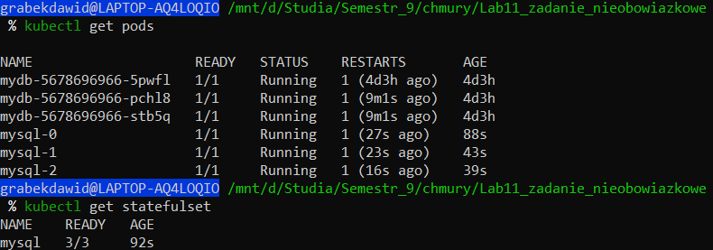
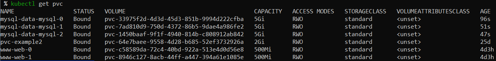
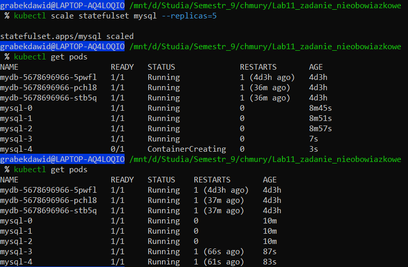
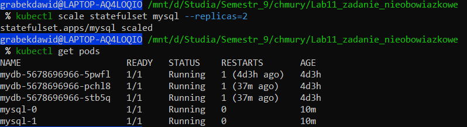

# Zadanie

Repozytorium zawiera manifesty Kubernetes umożliwiające wdrożenie bazy danych MySQL za pomocą StatefulSet. Przykład obejmuje skalowanie w górę i w dół.

## Pliki

- `mysql-service.yaml`: Definicja usługi **mysql-headless** dla adresowania DNS-owego Podów.
- `mysql-statefulset.yaml`: Konfiguracja StatefulSet dla MySQL z trwałym przechowywaniem danych.
- `mysql-secret.yaml`: Zakodowane dane uwierzytelniające MySQL.

## Wymagania wstępne

1. Klaster Kubernetes (minikube lub klaster w chmurze).
2. Zainstalowane i skonfigurowane narzędzie kubectl.

## Kroki wdrożenia

1. **Zastosowanie manifestów:**

   ```bash
   kubectl apply -f <każdy plik z osobna>
   ```

2. **Weryfikacja StatefulSet i Podów:**

   ```bash
   kubectl get statefulset
   kubectl get pods
   ```

   

3. **Sprawdzenie trwałych wolumenów:**

   ```bash
   kubectl get pvc
   ```

   

4. **Połączenie z MySQL:**
   Przekierowanie portu 3306 na lokalną maszynę:
   ```bash
   kubectl port-forward mysql-0 3306:3306
   ```
   Użycie klienta MySQL do połączenia:
   ```bash
   mysql -u student -ppassword123 -h 127.0.0.1 -P 3306
   ```

## Skalowanie StatefulSet

### Skalowanie w górę

Zwiększenie liczby replik:

```bash
kubectl scale statefulset mysql --replicas=5
```

Weryfikacja nowych Podów:

```bash
kubectl get pods
```



Sprawdzenie replikacji danych i kolejności inicjalizacji Podów.

### Skalowanie w dół

Zmniejszenie liczby replik:

```bash
kubectl scale statefulset mysql --replicas=2
```

```bash
kubectl get pods
```


Upewnienie się, że Pody są usuwane w odwrotnej kolejności (najwyższy indeks jako pierwszy):

## Kluczowe obserwacje

1. **Kolejność inicjalizacji Podów:** Pody są tworzone sekwencyjnie, zachowując porządek.
2. **Trwałe przechowywanie danych:** Każdy Pod zachowuje swój wolumen, co zapobiega utracie danych.
3. **Usługa Headless:** Każdy Pod jest dostępny przez DNS, np. `mysql-0.mysql-headless`.
